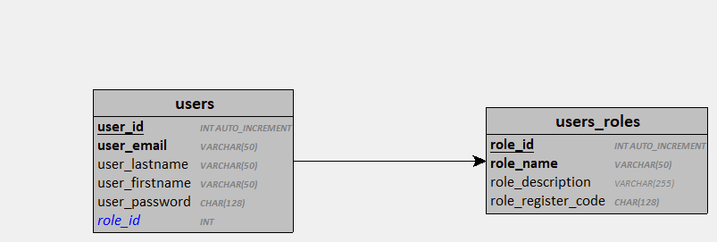

# APPLICATION FIL ROUGE

## Gestion d'utilisateurs

Développer une petite application de gestion d'utilisateur.
- Application de gestion d'utilisateurs
- L'application est utilisable via une interface HTML/CSS/JS
- La base de données sera une base SQLite 3
- L'application est utilisable uniquement par les utilisateurs enregistrés et authentifiés
- Les utilisateurs non identifiés sont des "invités"
- Un utilisateur est caractérisé par un nom, un prénom, une adresse email, un mot de passe chiffré et une
description
- Un utilisateur enregistré possède 1 rôle parmi la liste suivante :
    - Usager
    - Encadrant
    - Responsable
    - Administrateur
- Un rôle est caractérisé par un nom, une description et un code d'inscription chiffré.

### Dictionnaire des données 

| Mnémonique | Signification | Type | Longueur | Remarques |
| --- | --- | --- | --- | ---|
| user_id | Identifiant de l'utilisateur | INT | 11 | Identifiant, A.I |
| user_email | Email de l'utilisateur | VARCHAR | 50 | Obligatoire, unique |
| user_lastname | Nom de l'utilisateur | VARCHAR | 50 | Obligatoire |
| user_firstname | Prénom de l'utilisateur | VARCHAR | 50 | Facultatif |
| user_password | Mot de passe chiffré de l'utilisateur | CHAR | 128 | Obligatoire, chiffré avec Argon2 |
| role_id | Identifiant du rôle | INT | 11 | Identifiant, A.I  |
| role_name | Nom du rôle | VARCHAR | 50 | Obligatoire, unique |
| role_description | Description du rôle | VARCHAR | 255 | Facultatif |
| role_register_code | code d'inscription du rôle | CHAR | 128 | Obligatoire, chiffré avec Argon2 |

### MCD & MLD

### SQL

[Script d'installation SQLite3](./users.sqlite.sql) 

[Script d'installation MySQL/MariaDB](./users.mysql.sql)

## FONCTIONNALITES

1. Invité
    1. Un invité peut s'identifier
    2. Un invité peut créer un compte s'il dispose du code d'inscription
    3. Un invité peut demander à réinitialiser son mot de passe
2. Utilisateur
    1. Un utilisateur peut consulter son profil
    2. Un utilisateur peut modifier les informations de son propre profilsauf son rôle
    3. Un utilisateur peut parcourir la listes des utilisateurs enregistrés
3. Administrateur
    1. Un administrateur est un utilisateur avec privilèges accrus
    2. Un utilisateur peut consulter le profil de n'importe quel utilisateur
    3. Un administrateur peut modifier toutes les informations d'un utilisateur enregistré
    4. Un administrateur peut ajouter un utilisateur sans code d'inscription
    5. Un administrateur peut supprimer un utilisateur

Si nécessaire, ajouter les cas d'utilisation supplémentaires que vous jugerez pertinents. Toutefois, gardez en mémoire que dans un projet client, chaque fonctionnalité ajoutée coûte du temps et doit être justifiée auprès des décideurs.

## TRAVAIL A REALISER
- Réaliser l'analyse (cas d'utilisation, développer les scénarios)
- Concevoir et implémenter la couche d'accès aux données
- Développer les composants d'accès aux données
- Développer l'interface utilisateur
